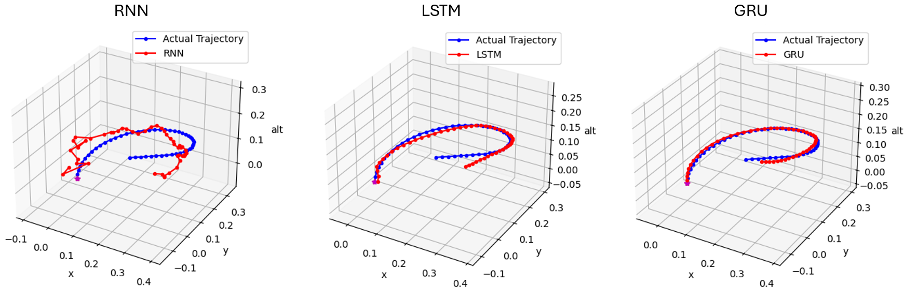
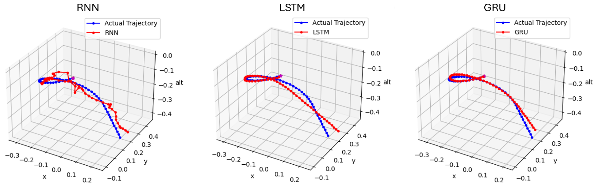
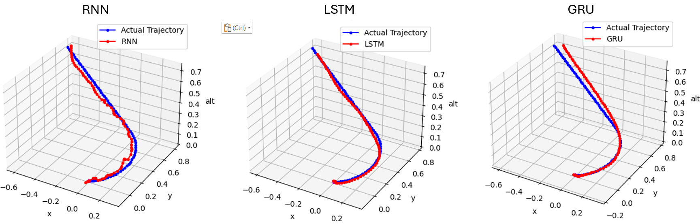

# Dubin's Airplane Trajectory Prediction with RNNs

The purpose of this assignment is to train a recurrent neural network to predict the trajectory of a Dubins airplane. A Dubin’s airplane is an airplane that follows a Dubin’s path, i.e. the shortest curve connecting two points in a 2D plane with a constraint on the curvature of the path with predefined initial and final tangents [1]. These paths are assuming that the vehicle or system moves only in the forward direction. In this case, a simplified version of the Dubin’s path is applied, where the goal heading is not defined. 
A custom dataset will be developed using a provided MATLAB function that computes a Dubin’s path given an initial position (x_1, y_1, and z_1), a goal position (x_2 and y_2), an initial heading (ψ), and a climb angle (γ). The dataset will be used to train three different RNN models to map the given initial and goal parameters to a trajectory. The trajectories from the three different models will be compared and evaluated.

The three figures below visualize the predictions generated by three RNN models.






## Dependencies

The dependencies for this project are included in the `requirements.txt` file.

The project utilizes Python 3.12.4 with the following packages and verisons:

- numpy==1.26.4
- matplotlib==3.8.4
- torch==2.4.0+cu124
- torchvision==0.19.0+cu124
- torchsummary==1.5.1
- tensorboard==2.17.1
- tensorboard-data-server==0.7.2
- scikit-learn==1.4.2

To install the required dependencies, run the following command:

```
pip install -r requirements.txt
```

## Running the Model

The `src` folder contains the script that contains all the code developed for this project. 

### Generating Data

To run the code, first the dataset needs to be generated. Note: If you don't want to generate a dataset, the dataset is available in the `dataset_and_models` folder.

To do this, run the `generate_data.py` script. It can be run via an IDE or through the following command:
```
python generate_data.py
```

This will create a `.pt` file of the dataset and the dataloader. 

### Training the Model

Once the dataset is generated, the model can be trained. It loads the dataset previously generated. Note: A pretrained model is available in the `dataset_and_models` folder.

To do this, run the `training_and_testing.py` script. It can be run via an IDE or through the following command:
```
python training_and_testing.py
```

## Documentation
The `docs` folder contains a report of the project where the methodologies and results are discussed. 

## References
[1] Wikipedia Contributors, “Dubins path,” Wikipedia, Jan. 14, 2019. https://en.wikipedia.org/wiki/Dubins_path
